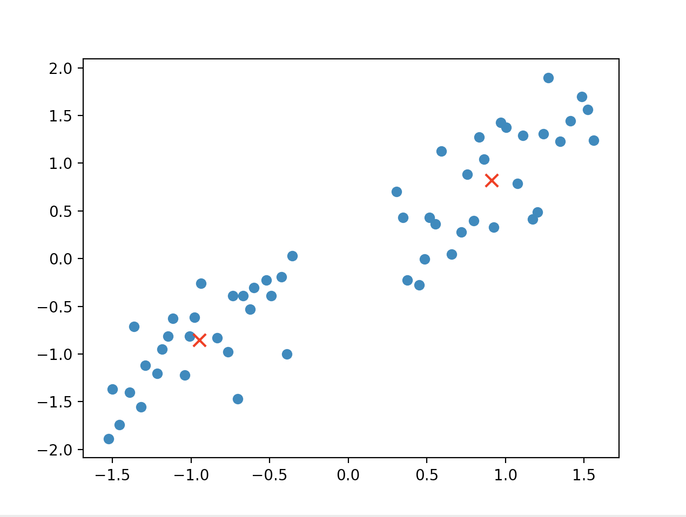

算法：		
	1.  随机选取任意k个点作为初始中心点	
	2. 通过距离的计算，对每个点进行聚类		
	3. 计算新的中心点	
	4. 通过计算中心点是否变化大于某个给定的阈值，如果大于，则再回到第二步进行循环。	

```
#!/usr/bin/env python 
# -*- coding: utf-8 -*- 
# @Time : 2018/3/12 下午5:01 

import numpy as np
from sklearn import preprocessing
import random
import matplotlib.pyplot as plt

def cluster(data, centroid):
    """聚类"""
    k_cluster = [ ]

    for i in range(len(centroid)):
        k_cluster.append([])

    for i in data:
        dis = [ ]
        for j in centroid:
            dis.append(np.linalg.norm(i-j))
        index = dis.index(min(dis))
        k_cluster[index].append(i)
    return k_cluster


def calcu_centroid(cluster):

    """计算中心坐标"""
    res = []
    for i in cluster:
         x_ = sum([j[0] for j in i])/ len(i)
         y_ = sum([j[1] for j in i])/ len(i)
         res.append((x_, y_))
    return res


def k_means(data, k):

    k_centroid = []

    for i in range(k):
        k_centroid.append(random.choice(data))

    while True:
        k_clus = cluster(data, k_centroid)  # 聚类

        centroid  = [np.array(i) for i in calcu_centroid(k_clus)] # 计算中心

        temp = centroid

        if np.linalg.norm(temp[0] - k_centroid[0]) > 1e-3:
            k_centroid = temp

        else:
            break

    return k_centroid

def generate_data():
    data_list = [ ]
    num = 1
    for i in range(200):
        if i < 170 and i > 40 and random.randint(1,10) > 3:
            if num < 80:
                x_temp = i+random.randint(2,5)/10
                y_temp = (80 + 2 * i+random.randint(2,5)/10)+random.randint(-45,45)
                if x_temp > 85  and x_temp < 103 or x_temp < 50 or x_temp > 140:
                    pass
                else:
                    data_list.append((x_temp,y_temp))
                    num += 1
            else:
                break
        else:
            pass

    res = np.array(data_list)/10
    "以下进行数据的均值标准化"
    res  = preprocessing.scale(res)

    return res

if __name__ == '__main__':
    res = generate_data()
    x = [i[0] for i in res]
    y = [i[1] for i in res]
    plt.scatter(x,y)
    res_x_y = k_means(res, 2)
    res_x = [ i[ 0 ] for i in res_x_y ]
    res_y = [ i[ 1 ] for i in res_x_y ]
    plt.scatter(res_x, res_y, s = 70, c = 'r', marker = 'x')
    plt.show()
    
```

